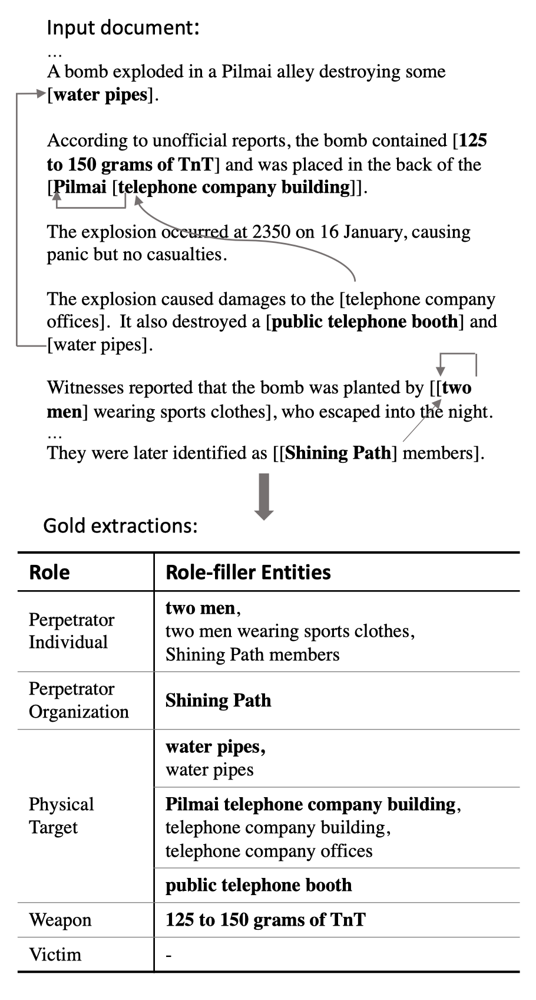
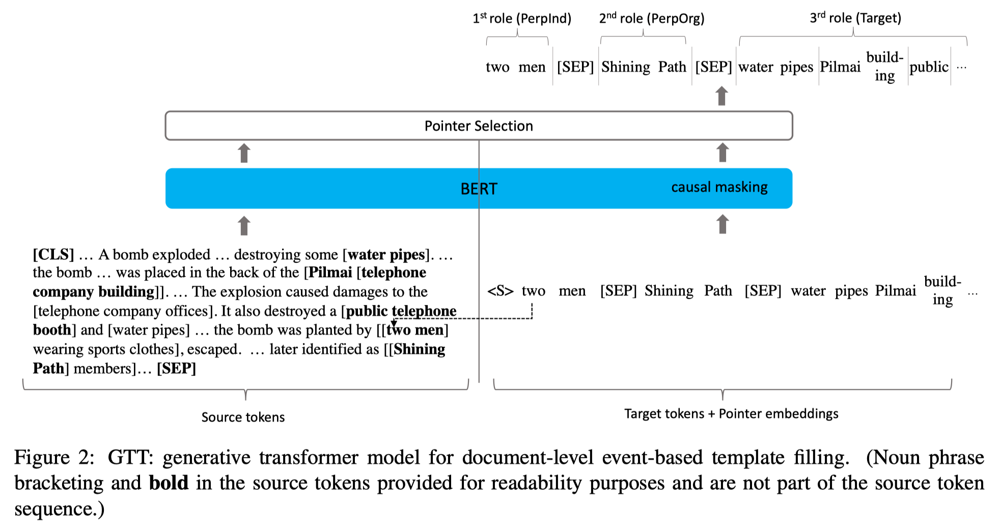

# GRIT: Generative Role-filler Transformers for Document-level Event Entity Extraction ([link](http://arxiv.org/abs/2008.09249)) EACL'21

  

## Dependencies

* Python 3.6.10
* Transformers: [transformers 2.4.1](https://github.com/huggingface/transformers/tree/2c12464a20160061a8b436b4939e8d5fa2437a15) installed from source.
* Pytorch-Lightning==0.7.1
* Pytorch==1.4.0
* seqeval

## Dataset 
* `./data/muc`, refer to `./data/muc/README.md` for details

## Eval
* import eval_ceaf, `from eval import eval_ceaf`, read `eval.py` for details
* eval on preds.out `python eval.py --pred_file model_gtt/preds_s_t.out`
* run simple test case: `python test_cases_eval.py`

## GRIT model 

  

* The encoder-decoder model (code is written based on hugging face [transformers/examples/ner/3ee431d](https://github.com/huggingface/transformers/tree/3ee431dd4c720e67e35a449b453d3dc2b15ccfff)
* How to run: see README in model_gtt

## Citation
If you use materials in this repo helpful, please cite.
